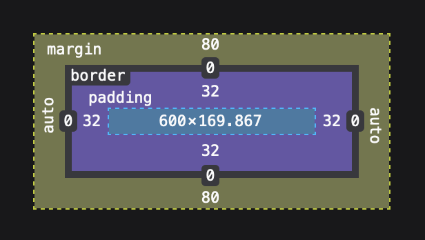
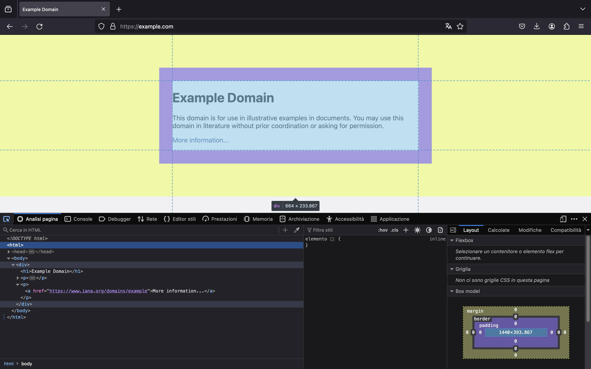
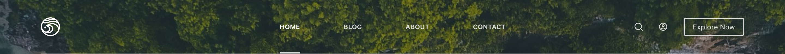
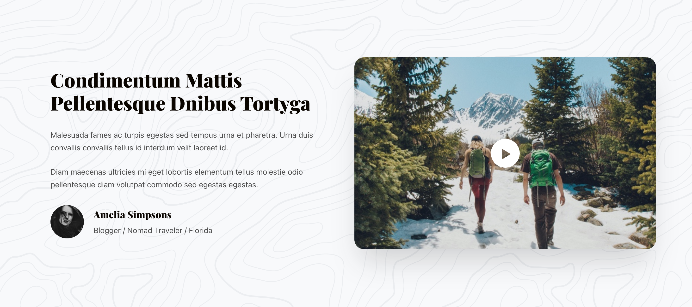
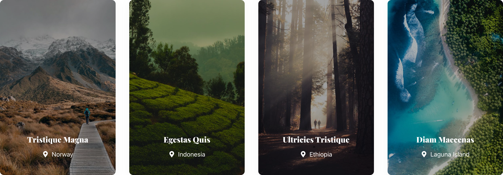
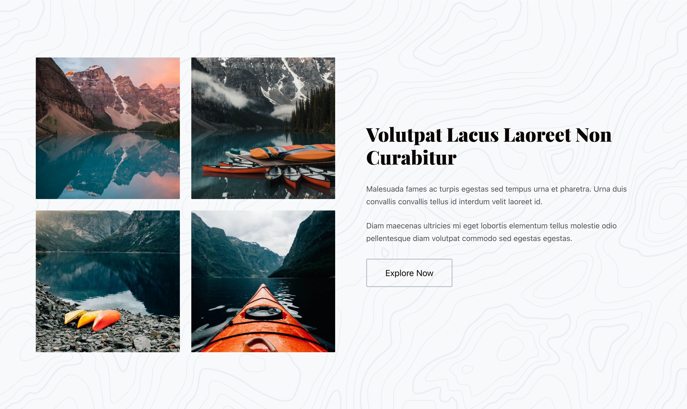
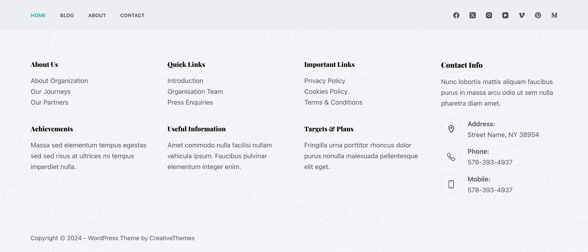

# Sviluppo Web

## Panoramica

- **Internet**: ...

- **Sito Web**: ...

- **Browser**: ...

- **Motore di ricerca**: ...

---

*Tipologie di sito:*

- **Business**: ...

- **E-commerce**: ...

- **Blog**: ...

- **Portfolio**: ...

### Dominio

...

*Estensioni:*

- **Business**: `.it` `.ch` `.fr` `.de` `.com`

- **E-commerce**: `.com`

- **Blog**: `.com` `.net` `.org` `.blog` `.info`

- **Portfolio** `.com` `.me` `.io`

## Elementi HTML

*Tag:*

- **Intestazione** `<h1>` / `<h6>`: ...

- **Paragrafo** `
`: ...

- **Bottone** `<button>`: ...

- **Link** `<a>`: ...

- **Immagine** ``: ...

- **Lista** `<ul>`: ...

- **Elemento lista** `<li>`: ...

## CSS Box Model

- **Margin**: ...

- **Border**: ...

- **Padding**: ...

- **Content**: ...

Visita: https://example.com/. Analizza `F12` ...

---

---

## Header

...

### Navbar

...

### Hero

...

## Main

...

### Cards

...

### Features

...

### CTA (Call-to-Action)

...

### Contact Form

...

### Blog

...

### Single Post

...

### Shop

...

### Single Product

...

### Layout

- Container: ...

- Row: ...

- Column: ...

## Footer

...

### Pagine

*Tutti:*

- Home: `index.html`: ...

- Chi siamo: `about.html`: ...

- Contatti: `contacts.html`: ...

- 404: `404.html`: ...

---

*Business:*

- Servizi: `services.html`: ...

E-commerce:

- Negozio: `shop.html`: ...

- Single Product: `single-product.html`: ...

*Blog:*

- Blog: `blog.html`: ...

- Single Post: `single-post.html`: ...

## Wordpress

- Content Management System (CMS): ...

- Plug-ins: ...

### Template

...

*Strumenti:*

- Editor di Wordpress: ...

- **Blocksy**: [creativethemes.com/blocksy](https://creativethemes.com/blocksy)

### Blog

...

*Strumenti:*

- Editor di Wordpress: ...

### E-commerce

...

*Strumenti:*

- Editor di Wordpress: ...

- **WooCommerce**: [WooCommerce](https://woocommerce.com)

### SEO

...

*Strumenti:*

- **Yoast SEO** : [yoast.com](https://yoast.com)
